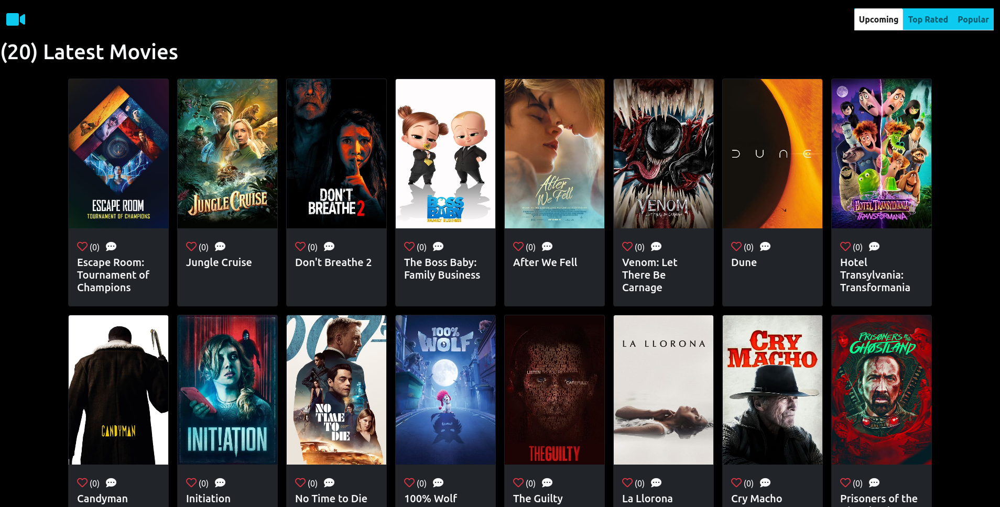
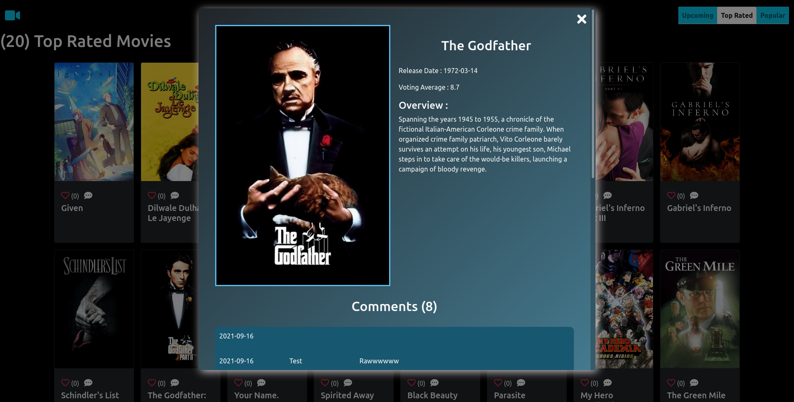
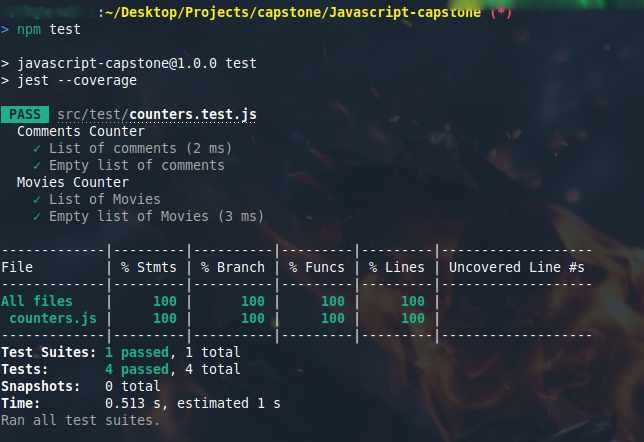

# Movie Lover

> web application for listing the latest/top-rated/popular movies from [themoviedb](https://api.themoviedb.org/) , with a simple but elegant UI.
This application also allow you to like and comment movies using [Involvment API](https://www.notion.so/Involvement-API-869e60b5ad104603aa6db59e08150270) and stores user liked items in the browser local storage.

## ScreenShots

## Live Demo

Deployed to Github Pages

[Live Demo Link](https://benwmx.github.io/MovieLover/)

## Demo Video

https://user-images.githubusercontent.com/60202444/133863713-7d8646df-91c0-4af3-b8ce-54d6b03be870.mp4

## Built with

- Javascript
- HTML/CSS
- Bootstrap
- Webpack

## Getting Started

to use this repo please follow this steps : 

### Prerequisite
You need npm to run the webpack commands, if you don't already have it go to this link to install it in your machine [npm](https://docs.npmjs.com/downloading-and-installing-node-js-and-npm)

### Setup

- clone the repo : `https://github.com/benwmx/MovieLover.git`
- run `npm i` to install dependencies

### Usage
- run `npm start`

### Build
- run `npm build` to build project using webpack.

## Unit Testing [jest](https://jestjs.io/)
You can run unit test using this command `npm run test`
These are list of test we have writed:

👤 **Rachid Boudaoudi**

- GitHub: [@benwmx](https://github.com/benwmx)
- Twitter: [@ben_wmx](https://twitter.com/ben_wmx)
- LinkedIn: [Rachid Boudaoudi](https://www.linkedin.com/in/rachid-boudaoudi-1621a0183/)

👤 **Ahmad Zia Yousufi**
- GitHub: [@ahzia](https://github.com/ahzia)
- Twitter: [@ZiaYousofi](https://twitter.com/ZiaYousofi)
- LinkedIn: [Ahmad zia Yousufi](https://www.linkedin.com/in/ah-ziayosfi/)

## 🤝 Contributing

Contributions, issues, and feature requests are welcome!

Feel free to check the [issues page](../../issues/).

## Show your support

Give a ⭐️ if you like this project!

## 📝 License

This project is [MIT](./MIT.md) licensed.
